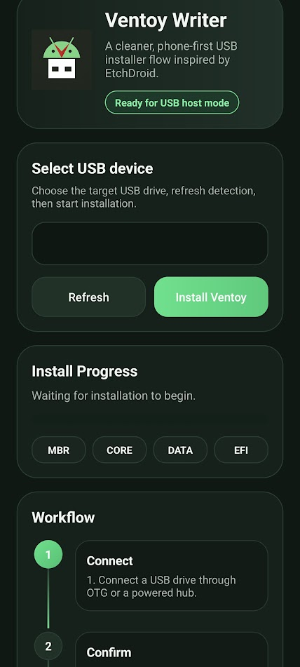

# Ventoid


Ventoid turns an Android phone into a practical Ventoy-style USB writer. Plug in a drive over OTG, pick the target device, and build a bootable Ventoy layout without needing a laptop in the middle.



- OTG-first workflow for rescue kits and field setup
- Direct USB mass-storage writing from Android
- Ventoy-style disk layout with data and EFI partitions
- Clear stage-based install flow for `MBR`, `CORE`, `DATA`, and `EFI`
- No ads, no analytics, no network dependency

## 한국어

Ventoid는 안드로이드 폰에서 바로 Ventoy 스타일 USB를 만드는 앱입니다. PC가 없거나, 폰 하나로 복구 USB를 준비해야 할 때 쓰기 좋게 설계했습니다.

### 이런 때 잘 맞습니다

- OTG 젠더로 USB를 바로 구워야 할 때
- 외부 PC 없이 현장에서 설치 USB를 준비해야 할 때
- 부팅용 USB를 자주 새로 만드는 작업 흐름이 필요할 때

### 핵심 기능

- 연결된 USB 저장장치 감지
- Android USB 권한 요청 및 접근
- Ventoy 호환 디스크 레이아웃 작성
- `core.img`와 EFI 이미지 기록
- 데이터 파티션 exFAT 포맷
- 단계별 진행 상태와 로컬 로그 표시

### 프로젝트 정보

- 패키지: `com.ventoid.app`
- 모듈: `app`
- 최소 SDK: 21
- 타깃 SDK: 35
- 라이선스: `GPL-3.0-or-later`

### 주요 소스

- `app/src/main/java/com/ventoid/app/MainActivity.kt`
- `app/src/main/java/com/ventoid/app/install/VentoyInstallCoordinator.kt`
- `app/src/main/java/com/ventoid/app/installer/VentoyInstaller.kt`
- `app/src/main/java/com/ventoid/app/installer/ExFatFormatter.kt`
- `app/src/main/java/com/ventoid/app/usb/UsbMassStorageHelper.kt`

### 번들 자산

- `app/src/main/assets/boot/boot.img`
- `app/src/main/assets/boot/core.img`
- `app/src/main/assets/ventoy/ventoy.disk.img`

### 테스트

```bash
./gradlew :app:testDebugUnitTest
```

## English

Ventoid is an Android app for creating Ventoy-style USB drives directly from a phone. It is built for OTG workflows, repair kits, and the very real moment when your phone is the only machine you have on hand.

### Why people use it

- Prepare a bootable USB without a PC
- Rebuild install media in the field
- Keep a cleaner, phone-first workflow for rescue drives

### Core features

- Detect attached USB mass-storage devices
- Request Android USB permission only when needed
- Write a Ventoy-compatible disk layout
- Write `core.img` and the EFI image
- Format the data partition as exFAT
- Show stage-based progress and a local write log

### Project info

- package: `com.ventoid.app`
- module: `app`
- min SDK: 21
- target SDK: 35
- license: `GPL-3.0-or-later`

### Key source files

- `app/src/main/java/com/ventoid/app/MainActivity.kt`
- `app/src/main/java/com/ventoid/app/install/VentoyInstallCoordinator.kt`
- `app/src/main/java/com/ventoid/app/installer/VentoyInstaller.kt`
- `app/src/main/java/com/ventoid/app/installer/ExFatFormatter.kt`
- `app/src/main/java/com/ventoid/app/usb/UsbMassStorageHelper.kt`

### Bundled assets

- `app/src/main/assets/boot/boot.img`
- `app/src/main/assets/boot/core.img`
- `app/src/main/assets/ventoy/ventoy.disk.img`

### Test

```bash
./gradlew :app:testDebugUnitTest
```

## 中文

Ventoid 是一款面向 Android 的 USB 启动盘写入工具。只要手机支持 OTG，就可以直接把 U 盘写成 Ventoy 风格的启动盘，不用再临时找电脑救场。

### 适合哪些场景

- 手边只有手机，需要马上做启动盘
- 维护、装机、救援时需要随时重做 USB
- 想把制作启动盘这件事变成更轻便的移动流程

### 主要功能

- 检测已连接的 USB 存储设备
- 按需申请 Android USB 访问权限
- 写入兼容 Ventoy 的磁盘布局
- 写入 `core.img` 和 EFI 镜像
- 将数据分区格式化为 exFAT
- 用分阶段界面显示进度和本地日志

### 项目信息

- 包名：`com.ventoid.app`
- 模块：`app`
- 最低 SDK：21
- 目标 SDK：35
- 许可证：`GPL-3.0-or-later`

### 关键源码

- `app/src/main/java/com/ventoid/app/MainActivity.kt`
- `app/src/main/java/com/ventoid/app/install/VentoyInstallCoordinator.kt`
- `app/src/main/java/com/ventoid/app/installer/VentoyInstaller.kt`
- `app/src/main/java/com/ventoid/app/installer/ExFatFormatter.kt`
- `app/src/main/java/com/ventoid/app/usb/UsbMassStorageHelper.kt`

### 随包资源

- `app/src/main/assets/boot/boot.img`
- `app/src/main/assets/boot/core.img`
- `app/src/main/assets/ventoy/ventoy.disk.img`

### 测试

```bash
./gradlew :app:testDebugUnitTest
```
